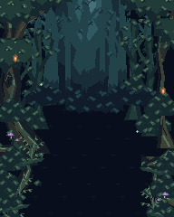
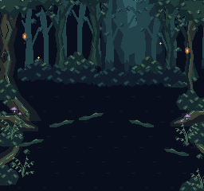

# Forest of Magic — Translation 01

**Candidate static pixel-art proof for Owner review. No runtime integration or art approval.**

This package translates the Owner-accepted generated Forest references into 16 canonical RoboPixel pieces and two independently arranged native scenes. It preserves twisted old growth, cool layered woodland, edge lanterns/violet mushrooms and an intentionally dark combat corridor. It does not preserve every painted detail from the references.

## Review

| View | Native proof | Enlarged | Comparison | Existing actor/UI witness |
| --- | --- | --- | --- | --- |
| Gameplay | [192×240](forest_gameplay_preview_192x240.png) | [3×](forest_gameplay_3x.png) | [V3 → reference → proof](gameplay_comparison.png) | [Illustrative](gameplay_staging_witness_3x.png) |
| Story/dialogue | [256×240](forest_story_preview_256x240.png) | [3×](forest_story_3x.png) | [V3 → reference → proof](story_comparison.png) | [Illustrative](story_staging_witness_3x.png) |

[Kit atlas at 2×](forest_asset_atlas_2x.png) · [Review HTML](preview.html) · [Canonical manifest](robopixel_manifest.json) · [Static verification](verification.json)




## Exact sources and repeatable workflow

- Project: `scarlet-moon-never-sets`. Asset IDs use `v4-forest-trans01-`; exact revision/hash, role, current approval status and paths are in `robopixel_manifest.json`.
- All 16 new assets are **revision 2, unapproved candidates**: created blank through `asset_create`, filled through `grid_paste`, then read back through `export_preview` and canonical `asset_view`. No delivery or approval was requested. `authoring_receipts.json` preserves the committed transaction receipts.
- `exports/*.json` contains the exact canonical indexed matrices, palette symbols, revision hashes and adapter round-trip results. `exports/*.png` is the actual canonical PNG read-back. `assets/*.png` is independently decoded from the matrices and compared pixel-for-pixel against those read-backs.
- `authoring_inputs.json` preserves the submitted exact editable token grids and indexed palette. `author_kit.py` documents the integer pixel authoring operations; it never opens a generated reference, samples its pixels, traces it, resizes it or quantizes it into assets. Substantial shapes are native stepped silhouettes with explicit bark ribbons and small designed leaf/fern clusters. They are not SVGs or procedural game rendering.
- `layouts.json` is the composition source: integer placements, optional horizontal reflection, alpha crop at the canvas edge and a solid background color only. No scene scaling, smoothing, palette remapping, pixel repainting or post-composition correction. `compose.py` consumes canonical exports by default. `--author-preview` is explicitly pre-submission only.
- `build_layouts.py` preserves the editable placement recipe. Both views reuse all 16 pieces, but have distinct layouts. Story is not any 192-wide crop of gameplay; the far opening is offset and the broad character stage is independently arranged.

### Reproduce locally

From this directory, using Python 3 and the version in `requirements.txt`:

```sh
python compose.py
python validate.py
```

The validator checks canonical grid/PNG correspondence, output dimensions, all PNG reproduction, exact 3× sampling, reference hashes, asset reuse, separate compositions and every tracked file from the base commit. It writes `verification.json`. It does not call RoboPixel or modify the game. To revise art later, change the appropriate canonical assets through RoboPixel, export the new exact revisions and update the manifest/inputs before regenerating; do not claim a local authoring edit updated RoboPixel.

## Kit

| Piece | Native size | Role |
| --- | --- | --- |
| depth-opening | 80×112 | Stepped, low-contrast distant opening; never stretched |
| far-grove | 56×104 | Distant crooked-tree group with restrained canopy |
| mid-tree | 36×112 | Middle-distance crooked trunk and branch clusters |
| elder-trunk | 64×176 | Twisted foreground elder trunk, moss ribbons, knot and rising branch |
| fork-trunk | 40×160 | Narrow forked foreground tree with asymmetric root foot |
| canopy | 64×40 | Asymmetric canopy mass; layered lobe clusters, broken underside |
| understory | 40×28 | Low irregular shrub with readable leaf masses |
| fern | 28×30 | Stepped fern fronds, deliberately sparse silhouette |
| root-bank | 64×32 | Root and moss transition shelf for lower edge framing |
| quiet-ground | 32×32 | Dark native ground field with sparse horizontal marks |
| moss-seam | 32×16 | Broken moss ledge for quiet clearing edges |
| lantern | 10×20 | Small hanging amber lantern, hard pixel light not glow |
| mushrooms | 16×16 | Two restrained violet mushroom caps |
| firefly | 5×5 | Single restrained edge light accent |
| root-crook | 60×72 | Curved near-root continuation, with broken moss crest |
| far-thicket | 64×32 | Low-contrast horizon thicket conceals hard trunk endpoints |

The common palette has 26 opaque entries plus transparent index 0. This is late-Famicom-inspired art, not a literal NES hardware/tile-bank compliance claim.

## Composition decisions and simplification

Gameplay weights bark, roots, ferns and lights toward the edges. The lower central rectangle x56–135/y128–239 contains only the two darkest ground colors, with sparse low-contrast marks; this is a static content check, not proof of moving danmaku readability. Upper woodland retains a controlled cool opening and silhouettes.

Story gives the existing Reimu (56,124), Marisa (152,108), grimoire and panel x4–251/y174–235 their own stage. The witness uses existing baseline pixels, not newly authored sprites or UI. A broad clearing replaces the gameplay passage; canopy, near trunks, horizon and roots have separate placements.

Painterly light shafts, dense microtexture and individual leaf detail were intentionally reduced to stepped color groups, bark ribbons and repeated native clusters. Lantern light is a few hard pixels. There is no blur, alpha glow or generated-image asset conversion.

## Provenance and authority

- Governing work: [Forest #25](https://github.com/raverx-dev/scarlet-moon-never-sets/issues/25), [V4 plan #24](https://github.com/raverx-dev/scarlet-moon-never-sets/issues/24). The Owner's subsequent **V4 Forest Translation 01** instruction authorizes this bounded proof and identifies the prior two reference images as accepted. The earlier reference-only stop is therefore superseded for this proof only.
- Working base: `d7054d2b9b111ff711f44cc3ee5b71268aca6ed8` (current main independently checked before branching). No prior Forest branch or canonical kit existed.
- Accepted reference images are preserved byte-for-byte in `references/`, matching the SHA-256 values in [reference return](https://github.com/raverx-dev/scarlet-moon-never-sets/issues/25#issuecomment-5807707547). They are generated concepts sampled for review, not exact native artwork. They are comparison inputs only.
- The V3/public-V4 comparisons reuse the earlier actual-source renders: frozen V3 `ea4c31aa8d2ad92e1a5d8bfb0f25d1ba0863ed31:index.html`, matching the published V3 payload; public V4 at the working base. They are **software Canvas source renders, not fresh browser captures**. Gameplay is tick900; story is Marisa-before frame60/line0. `references/source-renderer.cjs` preserves that renderer; it expects `source/v3.html`, `source/public-v4.html` and an `evidence` output directory in its cwd.
- Staging witnesses transplant baseline actors/UI/bullets using their differences against the baseline background. They are illustrative static composites, not integrated play, new character art or game QA. The preserved Astra experiment informed the earlier reference pass only; no experimental source was integrated here.

## Validation and deliberate limits

`verification.json` records the actual static results. All 23 base-tracked files, including every historical version and `versions/v4/index.html`, are byte-identical to the base. All new files are inside this proof directory. Git cleanliness and remote exact head are checked after committing and reported in the review return.

This proves canonical native-asset persistence, exact export/read-back and reusable composition at the two target sizes. **It does not claim final artistic acceptance.** The translation is intentionally simpler than the reference: crown/leaf variation, natural horizon transitions, root texture and lighting can receive a focused Owner-directed refinement. This pass does not include scrolling/seam design, animation, dense moving bullet QA, runtime integration, music, character changes, formal asset approval/delivery, merging or release.
