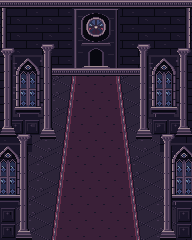
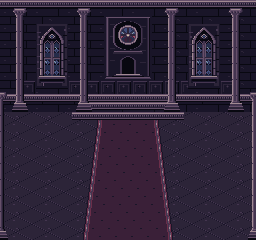
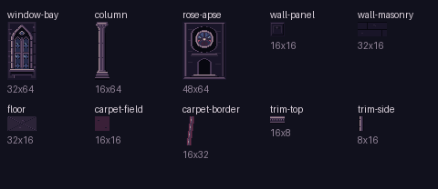

# V4 Mansion architectural kit proof

**Candidate for Owner review. Not approved, delivered, integrated, published or frozen.**

Ten small canonical RoboPixel pieces form two intentionally different Mansion interiors. Start with [the visual proof page](preview.html), or inspect the PNGs below directly in GitHub. The page is local/offline and does not publish or run the game.

| Gameplay · 192×240 | Story/dialogue · 256×240 |
|---|---|
|  |  |



## Scope and provenance

- Branch: `v4-mansion-architectural-kit-proof`.
- Base: `d7054d2b9b111ff711f44cc3ee5b71268aca6ed8`, current main when the mission began.
- Governing direction: [Scarlet Moon #17](https://github.com/raverx-dev/scarlet-moon-never-sets/issues/17), especially [Owner direction](https://github.com/raverx-dev/scarlet-moon-never-sets/issues/17#issuecomment-5771024579). The subsequent explicit Owner mission authorizes this bounded implementation beyond the earlier design-only checkpoint.
- First durable kit checkpoint: `1b5a150d04bb05e3838aac88b6f93007fa9aa880` (nine assets at revision 3). Final manifest supersedes that intermediate asset selection.
- RoboPixel project: `scarlet-moon-never-sets`; asset IDs begin `v4-mansion-proof-`. No RoboPixel source branch was needed or changed. Persistent asset revisions live in the existing project; exact exported candidates and evidence are copied here.
- All changes are confined to this directory. Frozen versions, live runtime, accepted splash, version selectors, public V4 preview and Astra candidate remain untouched.

## Review order

1. Compare the native gameplay and story previews. Judge pixel language, Mansion identity, visual hierarchy and distinct framing.
2. Check `mansion_story_staging.png`: unchanged V3 Reimu/Sakuya matrices and a coverage witness at the existing dialogue bounds. Check `mansion_gameplay_scale.png` for sprite scale. These are static composites, not gameplay captures or character proposals.
3. Inspect the atlas and `canonical_previews/` for actual reusable pieces. `layouts.json` records every use, crop and reflection.
4. Read [evaluation.md](evaluation.md) before deciding whether to authorize a larger, still bounded Mansion refinement pass.

## Contents

- Required outputs: this README, [asset inventory](asset_inventory.md), [workflow note](workflow_note.md), [evaluation](evaluation.md), both native previews, and the atlas.
- Reproducible source: `compose.py`, `layouts.json`, exact `exports/*.json`, `palette.json`.
- RoboPixel evidence: `robopixel_manifest.json`, `authoring_receipts.json`, `canonical_render_evidence.json`, `canonical_previews/*.png`, `validation_reports.json`.
- Authoring inputs: `author_grids.py` and `authoring_inputs.json`; these are tool inputs, not an alternative canonical asset store.
- Verification: `verify.py`, `verification.json`; static context witnesses: `review_context.py`, `sprite_witnesses.json`.
- Visual review: `preview.html`, native PNGs, nearest-neighbor 3× PNGs, and two source-bound reference renders.

## Reproduce

From this directory, with Python 3 and Pillow installed:

```sh
python3 compose.py
python3 verify.py
python3 review_context.py
```

Open `preview.html` directly. No server, browser installation, game build or RoboPixel write is required. Composition consumes only read-back RoboPixel exports; re-running the authoring script does not mutate RoboPixel.

## Verified limits

All ten canonical PNGs match the exported matrices byte-for-byte after RGBA decoding. All ten adapter exports report exact cel round-trip; all current validations pass, with unwaived pixel-orphan warnings. Both output dimensions are exact, every scene color belongs to the shared palette, and all files that existed on base main remain byte-identical. Approval status is false for every candidate.

This proves a small asset/export/assembly workflow. It does not certify hardware-exact NES restrictions, live danmaku readability, a complete scene editor, or final V4 visual acceptance. Stop here pending Owner instruction.
